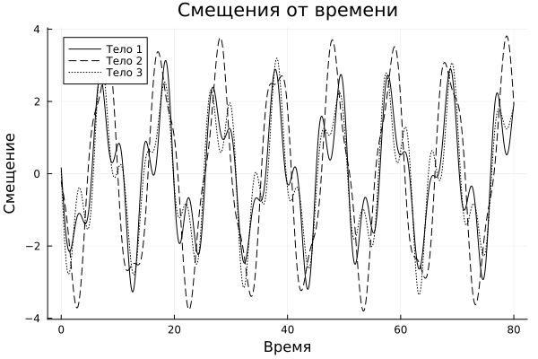

# Content  
1. [Introduction](#1-introduction)
2. [Task statement](#2-task statement)
3. [Methodology](#3-Methodology)
4. [Implementation description](#4-Implementation description)
5. [Results](#5-Results)
6. [Conclusion](#6-conclusion)  
7. [List of references](#7-list-of-references)  

## 1. Introduction

Oscillatory chains of connected masses and springs are a classical model in mechanics and solid state physics. Their study makes it possible to understand the properties of normal modes, dispersion, and resonance phenomena [1-3]. The aim of the work is to develop a software package for numerical modeling and visualization of the dynamics of a three-massive chain.

---

## 2. Setting the task

1. System parameters:
- Number of masses N = 3
- Masses m = [1, 2, 1]
- Spring stiffness k = [1, 1, 1, 1]
- Initial displacements R0 = [-0.2, 0, -0.3]
- Initial velocities v0 = [1, -3, 0]

2. Requirements:  
   - Construct a tridiagonal matrix Ω  
   - Find the eigenvalues of ωα^2 and the vectors Aa
- Determine the amplitudes Ca and phases φα
- Calculate Xi(t) and ẊI(t) on a grid of 2^13 points on t ∈ [0, 80]  
   - Visualize the key result — the time dependence of the displacement of the second body

---

## 3. Methodology

### 3.1 Stiffness matrix Ω  
The elements of the Ω matrix are given as:  
Ω(i,i) = (k_i + k_{i+1}) / m_i  
Ω(i,i+1) = -k_{i+1} / m_i  
Ω(i,i-1) = -k_i / m_i

### 3.2 Eigenvalues and vectors  
The problem is solved  
Ω * Aα = ωα^2 * Aα

### 3.3 Amplitudes and phases  
The system of equations for vector coefficients C1 and C2 in the initial state:
C1 * A = R0  
C2 * A = Ẋ(0)  
Then  
Cα = sqrt(C1_α^2 + C2_α^2)  
φα = atan2(C2_α, C1_α)

### 3.4 The Timing Grid  
t_j = (j - 1) / (2^13 - 1) * 80,  j = 1,…,2^13  
And the laws of motion:
Xi(t) = Σα Ca * Aa(i) * cos(ωα * t + φα)  
Ẋi(t) = -Σα Cα * ωα * Aα(i) * sin(ωα * t + φα)

---

## 4. Description of the implementation

The program for Julia includes:  
- Initialization of N, m, k, R0, v0  
- Construction of the W matrix  
- Calculation of the eigenvalues of ωα^2 and the vectors Α via eigen(Ω)  
- Solution for C1 and C2, calculation of Ca and φa  
- Generation of the time series Xi(t) and ẊI(t)  
- Plotting the displacement of the second body

---

## 5. Results

** Time dependence of displacement of bodies**

The graph shows how the displacement of the three links changes over time t ∈ [0, 80]. Characteristic fluctuations with a complex character are visible, due to the superposition of three normal modes.

---

##6. Conclusion

The developed algorithm and its implementation in the Julia language make it possible to effectively study the dynamics of an oscillatory system. The simulation results correspond to theoretical predictions, which confirms the correctness of the approach. Possible expansion directions:
- N > 3 masses  
- consideration of damping and external influences  
- modeling of uneven and periodic structures

---

## 7. List of literature

1. D. A. Medvedev and others. *Simulation of physical processes and phenomena on a PC*. Novosibirsk: NSU, 2010  
2. Getmanova E. G., Kostarev D. B. *Resonant phenomena in oscillator systems*, 2001  
3. Andronov A. A., Witt A. A. *Theory of oscillations*. Moscow: FIZMATLIT, 1981
``