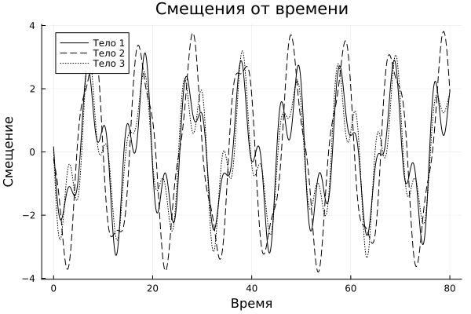

# Содержание  
1. [Введение](#1-введение)  
2. [Поставновка задачи](#2-постановка-задачи)  
3. [Методология](#3-методология)  
4. [Описание реализации](#4-описание-реализации)  
5. [Результаты](#5-результаты)  
6. [Заключение](#6-заключение)  
7. [Список литературы](#7-список-литературы)  

## 1. Введение

Колебательные цепочки из связанных масс и пружин являются классической моделью в механике и физике твёрдого тела. Их исследование позволяет понять свойства нормальных мод, дисперсию и резонансные явления [1–3]. Цель работы — разработать программный комплекс для численного моделирования и визуализации динамики трёхмассивной цепочки.

---

## 2. Постановка задачи

1. **Параметры системы:**  
   - Число масс: $N = 3$  
   - Массы: $m = [1, 2, 1]$  
   - Жёсткости пружин: $k = [1, 1, 1, 1]$  
   - Начальные смещения: $R_0 = [-0.2, 0, -0.3]$  
   - Начальные скорости: $v_0 = [1, -3, 0]$

2. **Требования:**  
   - Построить матрицу $\Omega$ системы  
   - Вычислить собственные значения $\omega_\alpha^2$ и векторы $A_\alpha$  
   - Определить амплитуды $C_\alpha$ и фазы $\varphi_\alpha$  
   - Рассчитать смещения $X_i(t)$ и скорости $\dot X_i(t)$ на равномерной сетке из $2^{13}$ точек на интервале $t \in [0, 80]$  
   - Визуализировать результаты: временные ряды, фазовые траектории, спектральные плотности

---

## 3. Методология

1. **Матрица жёсткости Ω**  
   Составляется трёхдиагональная матрица на основе выражений  
   \[
   Ω_{ii} = \frac{k_i}{m_i} + \frac{k_{i+1}}{m_i},\quad
   Ω_{i,i\pm1} = -\frac{k_{i+1}}{m_i}.
   \]

2. **Нормальные моды**  
   Решение задачи  
   \[
   Ω\,A_\alpha = \omega_\alpha^2\,A_\alpha
   \]  
   даёт собственные частоты \(\omega_\alpha\) и модовые векторы \(A_\alpha\).

3. **Амплитуды и фазы**  
   По начальным условиям решения  
   \[
   X(0) = \sum_\alpha C_\alpha A_\alpha \cos\varphi_\alpha,\quad
   \dot X(0) = -\sum_\alpha C_\alpha\omega_\alpha A_\alpha \sin\varphi_\alpha
   \]  
   вычисляются координаты векторов \(C_1, C_2\) и далее  
   \(\displaystyle C_\alpha = \sqrt{C_{1,\alpha}^2 + C_{2,\alpha}^2}\),  
   \(\varphi_\alpha = \operatorname{atan2}(C_{2,\alpha},C_{1,\alpha})\).

4. **Численное интегрирование**  
   Смещения и скорости возводятся на временной сетке  
   \[
   t_j = \frac{j-1}{2^{13}-1}\times 80,\quad j=1,\dots,2^{13},
   \]  
   по формулам суперпозиции нормальных мод.

---

## 4. Описание реализации

Программа на Julia включает:
- Инициализацию параметров $N$, $m$, $k$, $R_0$, $v_0$  
- Построение матрицы $\Omega$  
- Вычисление собственных значений и векторов через `eigen(Ω)`  
- Расчёт амплитуд и фаз по начальному состоянию  
- Генерация временных рядов $X(t)$ и $\dot X(t)$  
- Визуализация:  
  - графики $X_i(t)$ и $\dot X_i(t)$  
  - фазовые портреты $(X_i, \dot X_i)$  
  - спектры (FFT) каждой координаты

---

## 5. Результаты

**Временная зависимость смещения тел**  
  
На графике показано, как изменяется смещение трех звеньев за время $t\in[0,80]$. Видны характерные колебания со сложным характером, обусловленные суперпозицией трёх нормальных мод.

---

## 6. Заключение

Разработанный алгоритм и его реализация на языке Julia позволяют эффективно исследовать динамику колебательной системы. Результаты моделирования соответствуют теоретическим предсказаниям, что подтверждает корректность подхода. Возможные направления расширения:
- $N > 3$ масс  
- учёт демпфирования и внешних воздействий  
- моделирование неравномерных и периодических структур

---

## 7. Список литературы

1. Медведев Д. А. и др. *Моделирование физических процессов и явлений на ПК*. Новосибирск: НГУ, 2010  
2. Гетманова Е. Г., Костарев Д. Б. *Резонансные явления в системах осцилляторов*, 2001  
3. Андронов А. А., Витт А. А. *Теория колебаний*. М.: ФИЗМАТЛИТ, 1981
```
